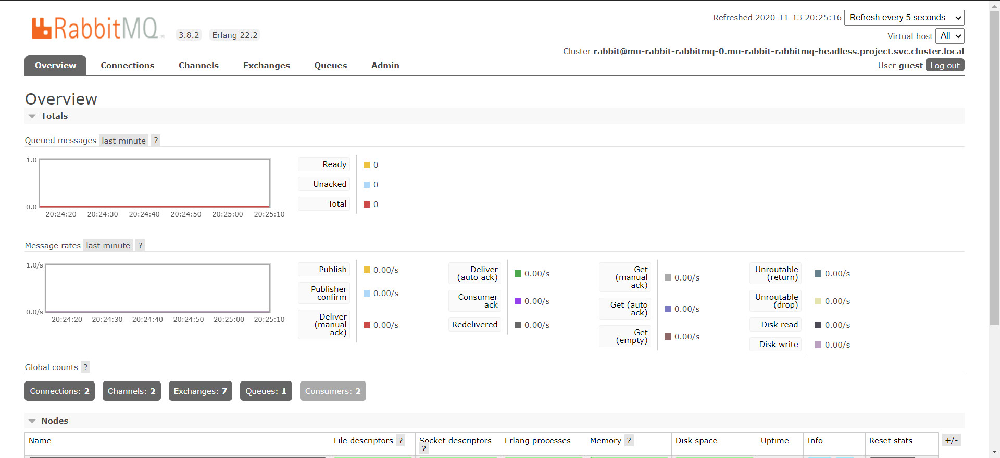
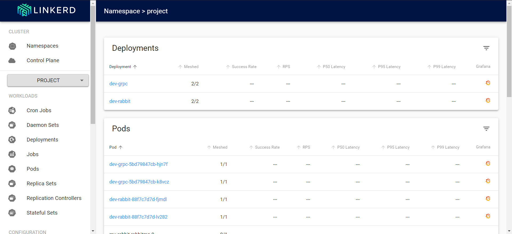
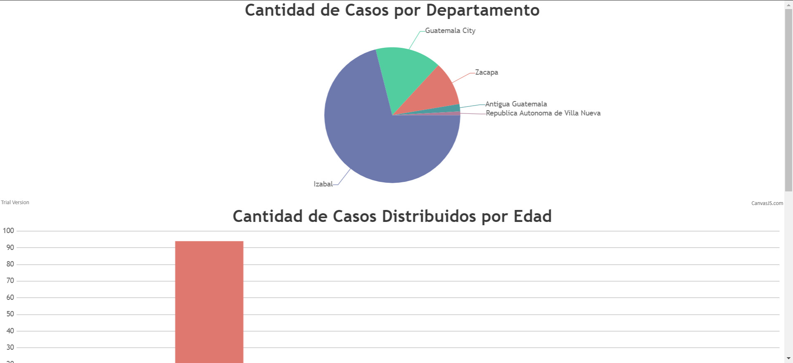

# Proyecto2_Sopes1

# Instalar helm (Windows) usando choco
```
>>> choco install kubernetes-helm
```
# Instalar nginx ingress
```
>>> helm repo add nginx-stable https://helm.nginx.com/stable
>>> helm repo update
>>> helm install my-release nginx-stable/nginx-ingress
```
# Instalar gloo ingress
```
>>> helm repo add gloo https://storage.googleapis.com/solo-public-helm
>>> helm repo update
>>> kubectl create namespace gloo-system helm install gloo gloo/gloo --namespace gloo-system --set gateway.enabled=false,ingress.enabled=true
>>> kubectl get all -n gloo-system
```
# Instalar Rabbitmq
```
>>> helm install mu-rabbit stable/rabbitmq --namespace project
```

# Injeccion a namespsace y pods
# Instalar linkerd en maquina local(pueden usar choco)
```
>>> linkerd check --pre
>>> linkerd install | kubectl apply -f -
>>> kubectl get -n project deploy -o yaml | linkerd inject -| kubectl apply -f -
```
# Observabilidad
```
>>> linkerd -n linkerd-demo stat deploy
```
```
>>> dashboard linkerd
```
```
>>> linkerd dashboard
```

# Finalizacion
# Clonar Repositorio
```
>>>  git clone https://github.com/Gary-Joan/Proyecto2_Sopes1.git
>>>  cd Archivos_yaml_kube
```
- Dentro del carpeta 
```
>>> kubectl apple -f -
```
- Esto ejecutara los archivos .yaml en orden como aparecen en la carpeta

# Aplicacion final prueba

- http://sopes1proyecto2.tk/

